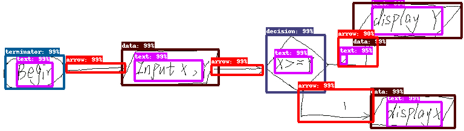
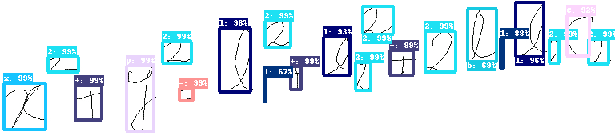

# Symbol detection in online handwritten graphics using Faster R-CNN
This repository contains the implementation of the models 
described in the paper "Symbol detection in online handwritten graphics using Faster R-CNN". 
A model is a Faster R-CNN network that takes an image of a handwritten 
graphic (flowchart or mathematical expression) as 
input and predicts the bounding box coordinates of the symbols that 
compose the graphic. The models are implemented 
using a fork of the the Tensorflow Object Detection API.

<p align="center">
Symbol detection in flowchart
<br>



</p>


<p align="center">
Symbol detetion in mathematical expression

<br>


</p>
 


## Citing this work
In case you use this work, please consider citing:

```
@inproceedings{frankdas:2018,
  title={Symbol detection in online handwritten graphics using Faster R-CNN},
  author={Frank Julca-Aguilar and Nina Hirata},
  booktitle={13th IAPR International Workshop on Document Analysis Systems (DAS)},
  year={2018}
 }
```

## Contents
1. [Installation](#installation)
2. [Evaluating the models](#evaluating)
3. [Training new models](#training)

## Installation
1. Clone the repository (with --recursive)

```
git clone --recursive https://github.com/vision-ime/faster-rcnn-graphics.git
```

The `recursive` option is necessary to download the fork version of 
the Tensorflow Object Detection API used in our experimentation.

2. Follow the [Tensorflow Object Detection API installation](https://github.com/tensorflow/models/blob/master/research/object_detection/g3doc/installation.md) 
instructions to set up the API, which was cloned in the tf-models folder (the `tf-models` 
folder corresponds to the `models` folder described in the API installation instructions).

## Evaluating the models
1. Download the datasets. In the directory where you cloned this repository do: 

```
./download_datasets.sh
```
The datasets will be saved in the `datasets` folder. 
Each dataset consist of Tensorflow's `.record` files, images of 
handwritten graphics, and xml metadata for each image.
As described in the paper, 
the datasets were using the 
[CROHME-2016](http://tc11.cvc.uab.es/datasets/ICFHR-CROHME-2016_1) and 
[flowcharts](http://ivc.univ-nantes.fr/en/databases/Flowchart/) datasets.  

2. Download a model.
Models can be download from: <http://www.vision.ime.usp.br/~frank.aguilar/graphics/models/>

For example, to download the model for symbol detection in flowcharts, trained with inception V2:
```
wget http://www.vision.ime.usp.br/~frank.aguilar/graphics/models/flowcharts/flowcharts_inceptionv2.tar.gzip
```

In order better to organize the different files, we can  
save the model in the corresponding flowchart folder.

```
mkdir models/flowcharts/inceptionv2/trained
mv flowcharts_inceptionv2.tar.gzip models/flowcharts/inceptionv2/trained/
cd models/flowcharts/inceptionv2/trained
tar -xf flowcharts_inceptionv2.tar.gzip
``` 

3. Execute the evaluation script. In the folder in which you cloned this work, 
to evaluate the model downloaded in step 2, you can do

```
python tf-models/research/object_detection/eval.py \
    --logtostderr \
    --pipeline_config_path=models/flowcharts/inceptionv2/pipeline.config \
    --checkpoint_dir=models/flowcharts/inceptionv2/trained \
    --eval_dir=models/flowcharts/inceptionv2/eval \ 
    --gpudev=0 \
    --run_once=True 
```
The parameter `gpudev` indicates the GPU device that would be used to
evaluate the model. A value `-1` can be used to run over CPU. 
The rest of the parameters are defined 
as in the Object Detection API [(here)](https://github.com/tensorflow/models/blob/master/research/object_detection/g3doc/running_locally.md).

## Training new models
New models can be trained using

```
python tf-models/research/object_detection/train.py \
--logtostderr \
--pipeline_config_path=models/math/inceptionv2/pipeline.config \
--train_dir=models/math/inceptionv2/new_trained \ 
--gpudev=0 &
```
As in the case of evaluation, the parameters are defined   
[here](https://github.com/tensorflow/models/blob/master/research/object_detection/g3doc/running_locally.md).


  


